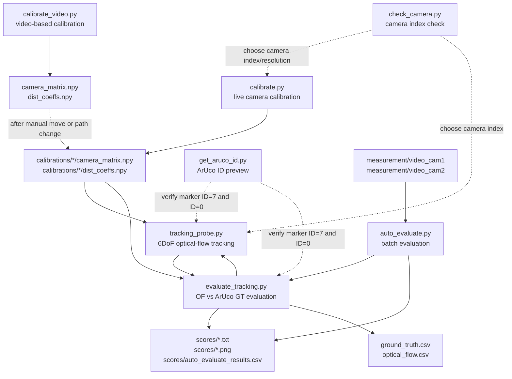

# Script Map

This file documents the role of each script in the repository, its inputs and outputs, and how the scripts relate to each other. The project is a toolset for 6DoF ultrasound probe tracking, camera calibration, and trajectory validation against an external ArUco-based ground truth system.

## Dependency Overview



## Main Workflow

1. `check_camera.py` helps identify available camera indices and their reported resolution/FPS.
2. `calibrate.py` or `calibrate_video.py` generates camera calibration matrices.
3. `get_aruco_id.py` verifies that the camera can see ArUco markers and reports their IDs.
4. `tracking_probe.py` runs the actual ultrasound probe tracker:
   - initializes when ArUco marker `ID=7` is detected,
   - uses the probe camera calibration from `calibrations/camera_jabra_640_360`,
   - tracks motion using Lucas-Kanade optical flow and homography decomposition.
5. `evaluate_tracking.py` compares optical-flow tracking against the external reference:
   - probe tracking comes from `tracking_probe.py`,
   - ground truth is computed from ArUco marker `ID=0`,
   - reports and plots are written to `scores/`.
6. `auto_evaluate.py` runs `evaluate_tracking.py` over many measurement folders.

## Scripts

| File | Purpose | Main inputs | Main outputs | Relations |
| --- | --- | --- | --- | --- |
| `tracking_probe.py` | Main 6DoF ultrasound probe tracker. It detects the initialization marker, then tracks image features with optical flow and updates position/rotation. | `--video`, `--camera`, calibration files from `calibrations/camera_jabra_640_360/*.npy`, ArUco marker `ID=7` with 20 mm size. | Optional `--save_video`, optional `--save_csv`; live windows `6DoF Tracking` and `Map (Top View)`. | Imported by `evaluate_tracking.py` as `UltrasoundProbeTracker6DoF`. This is the central tracking component. |
| `evaluate_tracking.py` | Validates optical-flow tracking against external ArUco ground truth. It builds both trajectories, computes MAE/RMSE, and generates plots. | `--video_probe`, `--video_ext`, `--calib_ext_dir`, probe calibration from `calibrations/camera_jabra_640_360/*.npy`, external calibration from `calibrations/camera_jabra_1920_1080/*.npy` by default, GT marker `ID=0` with 42.5 mm size. | `scores/<prefix>_rmse_result.txt`, `scores/<prefix>_validation_plot.png`, optional `--save_gt`, optional `--save_of`; returns `(mae_trans, rmse_trans)`. | Imports `UltrasoundProbeTracker6DoF` from `tracking_probe.py`. Can be run directly or called programmatically by `auto_evaluate.py`. |
| `auto_evaluate.py` | Batch runner for multiple measurements. It scans a measurement directory and runs `evaluate_tracking.main()` for each pair of recordings. | `--measurements_dir`, `--axes`, `--aruco_camera_offset`; expects `video_cam1` and `video_cam2` subfolders inside each measurement folder. | `scores/auto_evaluate_results.csv`; through `evaluate_tracking.py`, also writes per-measurement reports/plots and `ground_truth.csv` / `optical_flow.csv` inside measurement folders. | Imports `evaluate_tracking`, temporarily replaces `sys.argv`, and calls `evaluate_tracking.main()` in `--headless` mode. |
| `calibrate.py` | Interactive live camera calibration using a chessboard. | Camera `0`, requested 1920x1080 resolution, `s` to save a frame, `q` to finish. | `calibrations/camera_jabra_1920_1080/camera_matrix.npy`, `calibrations/camera_jabra_1920_1080/dist_coeffs.npy`. | Produces calibration files used by `evaluate_tracking.py` as the default external/reference camera calibration. |
| `calibrate_video.py` | Camera calibration from a recorded chessboard video. | Hardcoded `video_path = "..."`, chessboard parameters inside `calibrate_from_video()`, keys `s`, `space`, `d`, `q`. | `camera_matrix.npy`, `dist_coeffs.npy` in the repository root. | Not imported by other scripts. To use its output in tracking/evaluation, move the files into the proper `calibrations/...` directory or change the paths in the scripts. |
| `check_camera.py` | Helper utility to check whether camera indices `1` and `0` are available and what FPS/resolution they report. | Camera `1`, then camera `0`. | Console log. | Helps choose camera indices for `tracking_probe.py`, `calibrate.py`, `get_aruco_id.py`, and `evaluate_tracking.py --video_ext`. |
| `get_aruco_id.py` | Live preview that detects ArUco markers and prints their IDs. | Camera `0`, ArUco dictionary `DICT_4X4_50`. | `Aruco detection` preview window and console lines like `Found marker ID: ...`. | Helps verify the markers required by the pipeline: `ID=7` for `tracking_probe.py` initialization and `ID=0` for `evaluate_tracking.py` ground truth. |

## Data And Folders

| Path | Meaning | Used by |
| --- | --- | --- |
| `calibrations/camera_jabra_640_360/` | Probe camera calibration for 640x360. | `tracking_probe.py`, `evaluate_tracking.py`. |
| `calibrations/camera_jabra_1920_1080/` | Default external/reference camera calibration. | `evaluate_tracking.py`; generated by `calibrate.py`. |
| `calibrations/camera_jabra_1280_720/` | Additional 1280x720 calibration. | Not hardwired into the scripts currently, but can be used after changing the relevant argument/path. |
| `camera_matrix.npy`, `dist_coeffs.npy` in the repository root | Output of `calibrate_video.py`. | Not used automatically by the main scripts. |
| `scores/` | Evaluation output directory. | Created by `evaluate_tracking.py` and `auto_evaluate.py`. |
| `../measurements_with_imu` | Default batch measurement directory. | `auto_evaluate.py`. |

## Important Code-Level Relations

- `evaluate_tracking.py` imports `UltrasoundProbeTracker6DoF` from `tracking_probe.py`.
- `auto_evaluate.py` imports `evaluate_tracking` and calls its `main()` for each measurement.
- `tracking_probe.py` and `evaluate_tracking.py` load calibration matrices with `np.load(...)`.
- `calibrate.py` and `calibrate_video.py` save calibration matrices with `np.save(...)`.
- There is no shared configuration file; several paths and parameters are hardcoded in the scripts.

## ArUco Markers

| Marker | Used in | Meaning |
| --- | --- | --- |
| `ID=7`, 20 mm | `tracking_probe.py` | Initializes probe tracking and establishes the initial depth. |
| `ID=0`, 42.5 mm | `evaluate_tracking.py` | External-camera ground truth marker. |

## Typical Commands

```bash
python check_camera.py
python get_aruco_id.py
python calibrate.py
python tracking_probe.py --video path/to/probe.mp4 --save_csv output.csv
python evaluate_tracking.py --video_probe path/to/video_cam1.mp4 --video_ext path/to/video_cam2.mp4 --headless
python auto_evaluate.py --measurements_dir path/to/measurements --axes x,y,z,roll,pitch,yaw
```

## Technical Notes

- `calibrate_video.py` contains the placeholder `video_path = "..."`; replace it with a real calibration-video path before running it.
- `calibrate.py` saves calibration into `calibrations/camera_jabra_1920_1080`, while `tracking_probe.py` expects the probe calibration in `calibrations/camera_jabra_640_360`.
- `evaluate_tracking.py` writes output files into `scores/`, including in batch/headless mode.
- `auto_evaluate.py` detects axis overrides from folder names containing `__`, for example `measurement_01__x,y,yaw`.
- If `evaluate_tracking.py` receives `--load_gt`, it skips external-video processing and loads the ground-truth trajectory from CSV instead.
